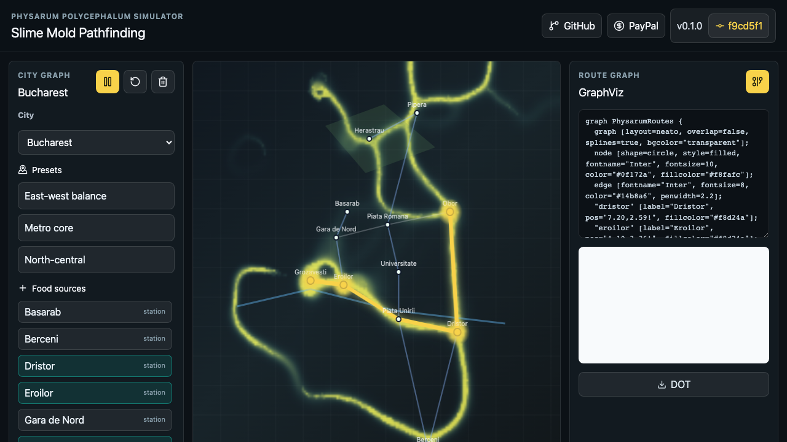
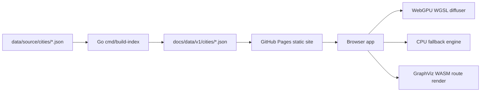

# slime-mold-pathfinding


Live app: https://baditaflorin.github.io/slime-mold-pathfinding/

Repository: https://github.com/baditaflorin/slime-mold-pathfinding

Support: https://www.paypal.com/paypalme/florinbadita

WebGPU Physarum simulator that turns city food sources into emergent transit-route candidates on a map.

The public page shows the repository link, PayPal link, app version, and the exact git commit used for the build.



## Quickstart

```sh
npm install
make data
make build
make pages-preview
```

## What It Does

Drop food sources on a city graph, watch a Physarum-style agent field reinforce candidate corridors, and export the resulting route network through browser-side GraphViz.

V1 ships with Tokyo and Bucharest static fixtures. The data pipeline accepts a normalized libosmscout-compatible city export shape and writes browser artifacts into `docs/data/v1/cities/`.

## Architecture



Architecture docs: docs/architecture.md

ADRs: docs/adr/

Data contract: docs/data.md

Deploy guide: docs/deploy.md

## Local Checks

```sh
make test
make lint
make build
make smoke
```

Install hooks once:

```sh
make install-hooks
```

No GitHub Actions are used. Local hooks run formatting, linting, type checks, tests, build verification, smoke tests, and staged secret scanning with gitleaks when available.

## Deployment

GitHub Pages serves the `main` branch `/docs` folder:

https://baditaflorin.github.io/slime-mold-pathfinding/

Rollback is a git revert of the publishing commit.
