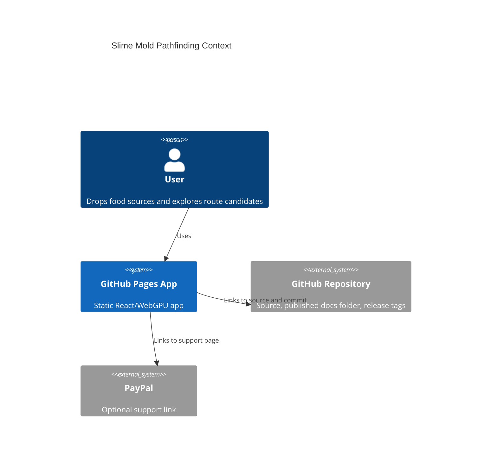
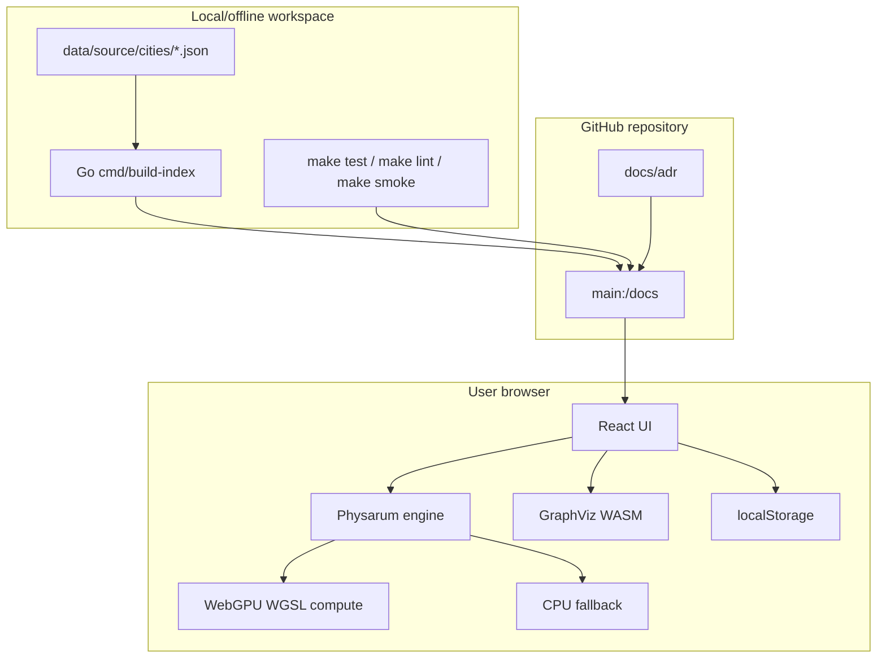

# Architecture

## Context

## Container

## Boundaries

- Public runtime boundary: GitHub Pages only.
- Static data boundary: `docs/data/v1/cities/`.
- Offline generation boundary: `cmd/build-index` and `internal/citydata`.
- Simulation boundary: `src/features/physarum`.
- Route extraction boundary: `src/features/routes`.
- GraphViz boundary: lazy `@hpcc-js/wasm` import.

## Pages Boundary

GitHub Pages serves only committed files in `docs/`. There is no runtime server, no API, no auth, no Docker image, and no nginx config in v1.
